# Sistema Completo: Agency, Gruppi e Menù a Prezzo Fisso

## Documento di Analisi e Progettazione

**Data**: 3 Dicembre 2025  
**Versione**: 1.1  
**Autore**: Sistema di Analisi Architetturale  
**Ultima Modifica**: Aggiunta gestione proposte personalizzate, esigenze alimentari, audit trail

---

## 📋 Indice

1. [Panoramica del Sistema](#1-panoramica-del-sistema)
2. [Analisi degli Attori](#2-analisi-degli-attori)
3. [Tipologie di Menù](#3-tipologie-di-menù)
4. [Sistema di Prenotazione](#4-sistema-di-prenotazione)
5. [Architettura delle Entità](#5-architettura-delle-entità)
6. [Logica di Business](#6-logica-di-business)
7. [Confronto Agency vs Customer](#7-confronto-agency-vs-customer)
8. [Modello di Pricing](#8-modello-di-pricing)
9. [Workflow Completo](#9-workflow-completo)
10. [Diagrammi](#10-diagrammi)
11. [Piano di Implementazione](#11-piano-di-implementazione)
12. [Sistema Proposte Personalizzate Agency](#12-sistema-proposte-personalizzate-agency)
13. [Gestione Esigenze Alimentari](#13-gestione-esigenze-alimentari)
14. [Collegamento con Sistema Dish Esistente](#14-collegamento-con-sistema-dish-esistente)

---

## 1. Panoramica del Sistema

### 1.1 Obiettivo
Creare un sistema che permetta:
- Alle **Agency** di cercare ristoranti per zona e prenotare per gruppi (matrimoni, tour, eventi corporate)
- Ai **Customer** privati di prenotare per eventi speciali (lauree, comunioni, compleanni)
- Ai **Restaurant** di pubblicare menù a prezzo fisso differenziati per target

### 1.2 Differenza Chiave
```
┌─────────────────────────────────────────────────────────────────────────────┐
│                         SISTEMA ATTUALE                                      │
│  Menu → MenuDish → Dish (prezzo per singolo piatto)                         │
├─────────────────────────────────────────────────────────────────────────────┤
│                         NUOVO SISTEMA                                        │
│  GroupMenu / FixedPriceMenu → Piatti inclusi (prezzo per menù completo)     │
│  - Prezzo TOTALE per persona                                                │
│  - Include: antipasti, primi, secondi, dessert, bevande                     │
│  - Opzioni: base, premium, luxury                                           │
└─────────────────────────────────────────────────────────────────────────────┘
```

---

## 2. Analisi degli Attori

### 2.1 Agency (B2B)

**Caratteristiche:**
- Aziende registrate con P.IVA
- Volume alto di prenotazioni
- Necessitano prezzi riservati/scontati
- Pagamento differito (fatturazione)
- Contratti quadro con ristoranti
- Gestiscono eventi ripetitivi (tour operator)

**Tipologie di Agency:**
```java
public enum AgencyType {
    TRAVEL,      // Tour operator - gruppi turistici
    TOURISM,     // Operatore turistico locale
    EVENT,       // Organizzatore eventi (matrimoni, feste)
    CORPORATE,   // Viaggi aziendali
    EDUCATIONAL, // Gite scolastiche
    WEDDING,     // Specializzato matrimoni
    DMC          // Destination Management Company
}
```

**Categorie Eventi Agency:**
```java
public enum AgencyEventCategory {
    TOUR_GROUP,           // Gruppo turistico
    CORPORATE_LUNCH,      // Pranzo aziendale
    CORPORATE_DINNER,     // Cena aziendale
    CONFERENCE_CATERING,  // Catering conferenze
    INCENTIVE_TRAVEL,     // Viaggi incentive
    SCHOOL_TRIP,          // Gita scolastica
    WEDDING_RECEPTION,    // Ricevimento matrimonio
    WEDDING_REHEARSAL     // Cena prova matrimonio
}
```

### 2.2 Customer Privato (B2C)

**Caratteristiche:**
- Utente singolo registrato
- Prenotazioni occasionali per eventi
- Prezzi pubblici standard
- Pagamento immediato o caparra
- Esigenze personalizzate

**Categorie Eventi Customer:**
```java
public enum CustomerEventCategory {
    GRADUATION,           // Laurea
    BIRTHDAY,             // Compleanno
    ANNIVERSARY,          // Anniversario
    COMMUNION,            // Comunione
    CONFIRMATION,         // Cresima
    BAPTISM,              // Battesimo
    ENGAGEMENT,           // Fidanzamento
    RETIREMENT,           // Pensionamento
    REUNION,              // Reunion famiglia/amici
    CELEBRATION,          // Celebrazione generica
    TASTING_EXPERIENCE    // Percorso degustazione
}
```

### 2.3 Restaurant

**Ruolo nel sistema:**
- Pubblica menù a prezzo fisso
- Decide visibilità: solo Agency, solo Customer, o entrambi
- Imposta prezzi differenziati
- Gestisce disponibilità per gruppi
- Negozia condizioni con Agency

---

## 3. Tipologie di Menù

### 3.1 Menù Attuale (Menu → MenuDish → Dish)
```
Menu "Pranzo Business"
├── Antipasto Misto      €12
├── Risotto Milanese     €16
├── Cotoletta            €22
└── Tiramisù             €8
    TOTALE à la carte: €58 (il cliente sceglie cosa ordinare)
```

### 3.2 Nuovo: Menù a Prezzo Fisso (FixedPriceMenu)
```
FixedPriceMenu "Menu Degustazione Toscano" - €45/persona
├── Antipasti (tutti inclusi)
│   ├── Crostini misti
│   ├── Affettati toscani
│   └── Bruschetta
├── Primo (scelta 1 tra)
│   ├── Pici cacio e pepe
│   └── Ribollita
├── Secondo (scelta 1 tra)
│   ├── Bistecca fiorentina (supplemento €15)
│   ├── Peposo
│   └── Arista
├── Dessert (scelta 1 tra)
│   ├── Cantucci e Vin Santo
│   └── Panna cotta
└── Bevande
    ├── Vino della casa (1/4 a persona)
    ├── Acqua
    └── Caffè
```

### 3.3 Struttura Concettuale

```
┌─────────────────────────────────────────────────────────────────────────────┐
│                      FIXED PRICE MENU STRUCTURE                              │
├─────────────────────────────────────────────────────────────────────────────┤
│                                                                              │
│  FixedPriceMenu                                                             │
│  ├── id                                                                      │
│  ├── name                                                                    │
│  ├── description                                                             │
│  ├── basePrice (prezzo per persona)                                         │
│  ├── minimumPax / maximumPax                                                │
│  ├── visibility (AGENCY_ONLY, CUSTOMER_ONLY, BOTH)                          │
│  ├── menuType (TASTING, GROUP, CELEBRATION, BUSINESS)                       │
│  │                                                                           │
│  └── MenuCourses (portate)                                                  │
│      ├── Course: ANTIPASTI                                                   │
│      │   ├── selectionType: ALL_INCLUDED / CHOICE_OF_N                      │
│      │   └── dishes: [dish1, dish2, dish3]                                  │
│      │                                                                       │
│      ├── Course: PRIMI                                                       │
│      │   ├── selectionType: CHOICE_OF_1                                     │
│      │   └── dishes: [dish4, dish5] (con eventuali supplementi)             │
│      │                                                                       │
│      ├── Course: SECONDI                                                     │
│      │   ├── selectionType: CHOICE_OF_1                                     │
│      │   └── dishes: [dish6, dish7, dish8]                                  │
│      │                                                                       │
│      ├── Course: DESSERT                                                     │
│      │   ├── selectionType: CHOICE_OF_1                                     │
│      │   └── dishes: [dish9, dish10]                                        │
│      │                                                                       │
│      └── Course: BEVANDE                                                     │
│          ├── selectionType: ALL_INCLUDED                                    │
│          └── beverages: [acqua, vino, caffè]                                │
│                                                                              │
└─────────────────────────────────────────────────────────────────────────────┘
```

---

## 4. Sistema di Prenotazione

### 4.1 Flusso Agency

```
┌─────────────────────────────────────────────────────────────────────────────┐
│                        AGENCY BOOKING FLOW                                   │
├─────────────────────────────────────────────────────────────────────────────┤
│                                                                              │
│  1. RICERCA                                                                  │
│     Agency cerca ristoranti per:                                            │
│     - Zona geografica (città, provincia, raggio km)                         │
│     - Capacità gruppo (min/max pax)                                         │
│     - Tipologia cucina                                                       │
│     - Budget per persona                                                     │
│     - Data disponibilità                                                     │
│     - Servizi extra (parcheggio bus, sala privata, etc.)                    │
│                                                                              │
│  2. SELEZIONE RISTORANTE                                                     │
│     Agency visualizza:                                                       │
│     - Menù riservati Agency (prezzi B2B)                                    │
│     - Condizioni speciali                                                    │
│     - Foto, recensioni, capacità                                            │
│                                                                              │
│  3. RICHIESTA PREVENTIVO (opzionale)                                         │
│     Agency può chiedere preventivo personalizzato:                          │
│     - Numero persone esatto                                                  │
│     - Richieste speciali (allergie, preferenze)                             │
│     - Servizi aggiuntivi                                                     │
│                                                                              │
│  4. PRENOTAZIONE/CONFERMA                                                    │
│     - Blocco data/ora                                                        │
│     - Selezione menù                                                         │
│     - Inserimento dati gruppo                                               │
│     - Accettazione condizioni                                                │
│                                                                              │
│  5. NEGOZIAZIONE (se necessario)                                             │
│     Chat/comunicazione per:                                                  │
│     - Modifiche menù                                                         │
│     - Prezzi speciali per volumi                                            │
│     - Condizioni pagamento                                                   │
│                                                                              │
│  6. CONFERMA FINALE                                                          │
│     - Contratto digitale                                                     │
│     - Caparra o pagamento                                                    │
│     - Generazione voucher                                                    │
│                                                                              │
└─────────────────────────────────────────────────────────────────────────────┘
```

### 4.2 Flusso Customer Privato

```
┌─────────────────────────────────────────────────────────────────────────────┐
│                       CUSTOMER BOOKING FLOW                                  │
├─────────────────────────────────────────────────────────────────────────────┤
│                                                                              │
│  1. RICERCA EVENTO                                                           │
│     Customer cerca per:                                                      │
│     - Tipo evento (laurea, comunione, etc.)                                 │
│     - Zona                                                                   │
│     - Numero invitati                                                        │
│     - Budget                                                                 │
│                                                                              │
│  2. VISUALIZZAZIONE                                                          │
│     Customer vede:                                                           │
│     - Menù pubblici (prezzi B2C)                                            │
│     - Pacchetti evento                                                       │
│     - Percorsi degustazione                                                  │
│                                                                              │
│  3. PRENOTAZIONE DIRETTA                                                     │
│     - Selezione menù                                                         │
│     - Numero partecipanti                                                    │
│     - Note speciali                                                          │
│     - Pagamento caparra online                                               │
│                                                                              │
│  4. CONFERMA                                                                 │
│     - Email conferma                                                         │
│     - Promemoria                                                             │
│     - Possibilità modifica (entro limiti)                                   │
│                                                                              │
└─────────────────────────────────────────────────────────────────────────────┘
```

---

## 5. Architettura delle Entità

### 5.1 Nuove Entità Proposte

```java
// ═══════════════════════════════════════════════════════════════════════════
// FIXED PRICE MENU - Menù a prezzo fisso
// ═══════════════════════════════════════════════════════════════════════════

@Entity
@Table(name = "fixed_price_menu")
public class FixedPriceMenu {
    @Id
    @GeneratedValue(strategy = GenerationType.IDENTITY)
    private Long id;
    
    @ManyToOne(fetch = FetchType.LAZY)
    @JoinColumn(name = "restaurant_id", nullable = false)
    private Restaurant restaurant;
    
    private String name;
    private String description;
    
    @Column(name = "base_price", nullable = false)
    private BigDecimal basePrice;  // Prezzo per persona
    
    @Column(name = "agency_price")
    private BigDecimal agencyPrice;  // Prezzo riservato agency (può essere null = stesso prezzo)
    
    @Column(name = "minimum_pax")
    private Integer minimumPax;  // Minimo partecipanti
    
    @Column(name = "maximum_pax")
    private Integer maximumPax;  // Massimo partecipanti
    
    @Enumerated(EnumType.STRING)
    private MenuVisibility visibility;  // AGENCY_ONLY, CUSTOMER_ONLY, BOTH
    
    @Enumerated(EnumType.STRING)
    private FixedPriceMenuType menuType;  // TASTING, GROUP, CELEBRATION, BUSINESS, WEDDING
    
    @OneToMany(mappedBy = "fixedPriceMenu", cascade = CascadeType.ALL)
    private List<MenuCourse> courses;
    
    @Column(name = "includes_beverages")
    private Boolean includesBeverages = false;
    
    @Column(name = "beverage_description")
    private String beverageDescription;  // "1/4 vino, acqua, caffè"
    
    @Column(name = "valid_from")
    private LocalDate validFrom;
    
    @Column(name = "valid_to")
    private LocalDate validTo;
    
    @Builder.Default
    private Boolean enabled = true;
    
    // Servizi inclusi
    @Column(name = "includes_private_room")
    private Boolean includesPrivateRoom = false;
    
    @Column(name = "includes_decoration")
    private Boolean includesDecoration = false;
    
    @Column(name = "includes_music")
    private Boolean includesMusic = false;
    
    @Column(name = "extra_notes")
    private String extraNotes;
}

public enum MenuVisibility {
    AGENCY_ONLY,    // Solo visibile alle agency
    CUSTOMER_ONLY,  // Solo visibile ai customer privati
    BOTH            // Visibile a entrambi (con prezzi diversi)
}

public enum FixedPriceMenuType {
    TASTING,        // Percorso degustazione
    GROUP_STANDARD, // Menù gruppo standard
    CELEBRATION,    // Menù celebrazione (lauree, comunioni)
    BUSINESS,       // Menù business lunch
    WEDDING,        // Menù matrimonio
    TOUR,           // Menù tour turistico
    KIDS            // Menù bambini (per eventi famiglia)
}

// ═══════════════════════════════════════════════════════════════════════════
// MENU COURSE - Portata del menù
// ═══════════════════════════════════════════════════════════════════════════

@Entity
@Table(name = "menu_course")
public class MenuCourse {
    @Id
    @GeneratedValue(strategy = GenerationType.IDENTITY)
    private Long id;
    
    @ManyToOne(fetch = FetchType.LAZY)
    @JoinColumn(name = "fixed_price_menu_id", nullable = false)
    private FixedPriceMenu fixedPriceMenu;
    
    @Enumerated(EnumType.STRING)
    private CourseType courseType;  // ANTIPASTO, PRIMO, SECONDO, CONTORNO, DESSERT, BEVERAGE
    
    private String name;  // Nome custom della portata (es: "Antipasti della casa")
    
    @Enumerated(EnumType.STRING)
    private SelectionType selectionType;  // ALL_INCLUDED, CHOICE_OF_N
    
    @Column(name = "selection_count")
    private Integer selectionCount;  // Se CHOICE_OF_N, quanti piatti scegliere
    
    @Column(name = "display_order")
    private Integer displayOrder;
    
    @OneToMany(mappedBy = "menuCourse", cascade = CascadeType.ALL)
    private List<CourseItem> items;
}

public enum CourseType {
    APPETIZER,  // Antipasto
    FIRST,      // Primo
    SECOND,     // Secondo
    SIDE,       // Contorno
    DESSERT,    // Dessert
    BEVERAGE,   // Bevande
    CHEESE,     // Formaggi
    FRUIT       // Frutta
}

public enum SelectionType {
    ALL_INCLUDED,  // Tutti i piatti sono inclusi
    CHOICE_OF_N    // Scelta di N piatti dalla lista
}

// ═══════════════════════════════════════════════════════════════════════════
// COURSE ITEM - Singolo piatto nella portata
// ═══════════════════════════════════════════════════════════════════════════

@Entity
@Table(name = "course_item")
public class CourseItem {
    @Id
    @GeneratedValue(strategy = GenerationType.IDENTITY)
    private Long id;
    
    @ManyToOne(fetch = FetchType.LAZY)
    @JoinColumn(name = "menu_course_id", nullable = false)
    private MenuCourse menuCourse;
    
    @ManyToOne(fetch = FetchType.LAZY)
    @JoinColumn(name = "dish_id")
    private Dish dish;  // Collegamento al piatto esistente (opzionale)
    
    private String name;  // Nome (se diverso dal dish o se dish è null)
    private String description;
    
    @Column(name = "supplement_price")
    private BigDecimal supplementPrice;  // Supplemento (es: +€15 per bistecca)
    
    @Column(name = "is_vegetarian")
    private Boolean isVegetarian = false;
    
    @Column(name = "is_vegan")
    private Boolean isVegan = false;
    
    @Column(name = "is_gluten_free")
    private Boolean isGlutenFree = false;
    
    @Column(name = "display_order")
    private Integer displayOrder;
}

// ═══════════════════════════════════════════════════════════════════════════
// GROUP BOOKING - Prenotazione di gruppo (sia Agency che Customer)
// ═══════════════════════════════════════════════════════════════════════════

@Entity
@Table(name = "group_booking")
public class GroupBooking {
    @Id
    @GeneratedValue(strategy = GenerationType.IDENTITY)
    private Long id;
    
    @ManyToOne(fetch = FetchType.LAZY)
    @JoinColumn(name = "restaurant_id", nullable = false)
    private Restaurant restaurant;
    
    // Chi prenota - uno dei due sarà valorizzato
    @ManyToOne(fetch = FetchType.LAZY)
    @JoinColumn(name = "agency_id")
    private Agency agency;
    
    @ManyToOne(fetch = FetchType.LAZY)
    @JoinColumn(name = "customer_id")
    private Customer customer;
    
    @Enumerated(EnumType.STRING)
    private BookerType bookerType;  // AGENCY, CUSTOMER
    
    @ManyToOne(fetch = FetchType.LAZY)
    @JoinColumn(name = "fixed_price_menu_id")
    private FixedPriceMenu selectedMenu;
    
    // Dettagli evento
    @Enumerated(EnumType.STRING)
    private EventCategory eventCategory;
    
    private String eventName;  // "Matrimonio Rossi-Bianchi"
    private String eventDescription;
    
    // Dati prenotazione
    @Column(name = "booking_date", nullable = false)
    private LocalDate bookingDate;
    
    @Column(name = "booking_time", nullable = false)
    private LocalTime bookingTime;
    
    @Column(name = "end_time")
    private LocalTime endTime;  // Orario fine previsto
    
    @Column(name = "pax", nullable = false)
    private Integer pax;
    
    @Column(name = "children_count")
    private Integer childrenCount = 0;
    
    // Pricing
    @Column(name = "price_per_person", nullable = false)
    private BigDecimal pricePerPerson;
    
    @Column(name = "children_price")
    private BigDecimal childrenPrice;  // Prezzo bambini (può essere ridotto)
    
    @Column(name = "total_supplements")
    private BigDecimal totalSupplements = BigDecimal.ZERO;
    
    @Column(name = "discount_percentage")
    private BigDecimal discountPercentage;  // Sconto applicato
    
    @Column(name = "total_amount", nullable = false)
    private BigDecimal totalAmount;
    
    @Column(name = "deposit_amount")
    private BigDecimal depositAmount;  // Caparra richiesta
    
    @Column(name = "deposit_paid")
    private Boolean depositPaid = false;
    
    // Status
    @Enumerated(EnumType.STRING)
    private GroupBookingStatus status;
    
    // Contatti
    private String contactName;
    private String contactPhone;
    private String contactEmail;
    
    // Note e richieste speciali
    @Column(columnDefinition = "TEXT")
    private String notes;
    
    @Column(columnDefinition = "TEXT")
    private String dietaryRequirements;  // Allergie, vegetariani, etc.
    
    @Column(columnDefinition = "TEXT")
    private String specialRequests;
    
    // Servizi extra
    private Boolean privateRoom = false;
    private Boolean busParking = false;
    private Boolean decoration = false;
    private Boolean photographer = false;
    private Boolean music = false;
    
    // Audit
    @Column(name = "created_at", nullable = false)
    private LocalDateTime createdAt;
    
    @Column(name = "updated_at")
    private LocalDateTime updatedAt;
    
    @Column(name = "confirmed_at")
    private LocalDateTime confirmedAt;
    
    // Reference code per tracking
    @Column(name = "booking_reference", unique = true)
    private String bookingReference;  // Es: "GRP-2024-001234"
}

public enum BookerType {
    AGENCY,
    CUSTOMER
}

public enum EventCategory {
    // Agency events
    TOUR_GROUP,
    CORPORATE_LUNCH,
    CORPORATE_DINNER,
    CONFERENCE,
    INCENTIVE,
    SCHOOL_TRIP,
    WEDDING_AGENCY,
    
    // Customer events
    GRADUATION,
    BIRTHDAY,
    ANNIVERSARY,
    COMMUNION,
    CONFIRMATION,
    BAPTISM,
    ENGAGEMENT,
    RETIREMENT,
    REUNION,
    WEDDING_PRIVATE,
    CELEBRATION_OTHER,
    TASTING
}

public enum GroupBookingStatus {
    INQUIRY,        // Richiesta informazioni
    QUOTE_SENT,     // Preventivo inviato
    PENDING,        // In attesa conferma
    CONFIRMED,      // Confermata
    DEPOSIT_PAID,   // Caparra versata
    COMPLETED,      // Evento completato
    CANCELLED,      // Cancellata
    NO_SHOW         // Non presentato
}

// ═══════════════════════════════════════════════════════════════════════════
// RESTAURANT AGENDA AGENCY - Collegamento ristorante-agenzia
// ═══════════════════════════════════════════════════════════════════════════

@Entity
@Table(name = "restaurant_agency")
public class RestaurantAgency {
    @Id
    @GeneratedValue(strategy = GenerationType.IDENTITY)
    private Long id;
    
    @ManyToOne(fetch = FetchType.LAZY)
    @JoinColumn(name = "restaurant_id", nullable = false)
    private Restaurant restaurant;
    
    @ManyToOne(fetch = FetchType.LAZY)
    @JoinColumn(name = "agency_id", nullable = false)
    private Agency agency;
    
    // Statistiche
    @Column(name = "total_bookings")
    private Integer totalBookings = 0;
    
    @Column(name = "total_guests")
    private Integer totalGuests = 0;
    
    @Column(name = "total_revenue")
    private BigDecimal totalRevenue = BigDecimal.ZERO;
    
    // Relazione
    @Column(name = "first_contact")
    private LocalDateTime firstContact;
    
    @Column(name = "last_booking")
    private LocalDateTime lastBooking;
    
    @Column(name = "is_preferred")
    private Boolean isPreferred = false;  // Agency preferita
    
    @Column(name = "is_blacklisted")
    private Boolean isBlacklisted = false;
    
    // Condizioni commerciali
    @Column(name = "special_discount")
    private BigDecimal specialDiscount;  // Sconto riservato
    
    @Column(name = "payment_terms")
    private String paymentTerms;  // "30 giorni", "Prepagato"
    
    @Column(name = "contract_notes", columnDefinition = "TEXT")
    private String contractNotes;
    
    @Column(name = "notes", columnDefinition = "TEXT")
    private String notes;
    
    @Column(name = "created_at")
    private LocalDateTime createdAt;
    
    @Column(name = "updated_at")
    private LocalDateTime updatedAt;
}

// ═══════════════════════════════════════════════════════════════════════════
// QUOTE REQUEST - Richiesta preventivo
// ═══════════════════════════════════════════════════════════════════════════

@Entity
@Table(name = "quote_request")
public class QuoteRequest {
    @Id
    @GeneratedValue(strategy = GenerationType.IDENTITY)
    private Long id;
    
    @ManyToOne(fetch = FetchType.LAZY)
    @JoinColumn(name = "restaurant_id", nullable = false)
    private Restaurant restaurant;
    
    @ManyToOne(fetch = FetchType.LAZY)
    @JoinColumn(name = "agency_id")
    private Agency agency;
    
    @ManyToOne(fetch = FetchType.LAZY)
    @JoinColumn(name = "customer_id")
    private Customer customer;
    
    @Enumerated(EnumType.STRING)
    private BookerType requesterType;
    
    // Richiesta
    @Enumerated(EnumType.STRING)
    private EventCategory eventCategory;
    
    private String eventDescription;
    private LocalDate preferredDate;
    private LocalDate alternativeDate;
    private Integer expectedPax;
    private BigDecimal budgetPerPerson;
    
    @Column(columnDefinition = "TEXT")
    private String requirements;
    
    // Risposta
    @Column(name = "quote_amount")
    private BigDecimal quoteAmount;
    
    @Column(name = "quote_valid_until")
    private LocalDate quoteValidUntil;
    
    @Column(columnDefinition = "TEXT")
    private String quoteDetails;
    
    @ManyToOne(fetch = FetchType.LAZY)
    @JoinColumn(name = "suggested_menu_id")
    private FixedPriceMenu suggestedMenu;
    
    @Enumerated(EnumType.STRING)
    private QuoteStatus status;
    
    @Column(name = "created_at")
    private LocalDateTime createdAt;
    
    @Column(name = "responded_at")
    private LocalDateTime respondedAt;
}

public enum QuoteStatus {
    PENDING,      // In attesa risposta ristorante
    QUOTED,       // Preventivo inviato
    ACCEPTED,     // Accettato, procede a prenotazione
    REJECTED,     // Rifiutato
    EXPIRED,      // Scaduto
    CANCELLED     // Annullato
}
```

---

## 6. Logica di Business

### 6.1 Regole per Menu Visibility

```java
// Logica di visualizzazione menù
public List<FixedPriceMenu> getVisibleMenus(Long restaurantId, UserType userType) {
    List<FixedPriceMenu> allMenus = fixedPriceMenuDAO.findByRestaurantId(restaurantId);
    
    return allMenus.stream()
        .filter(menu -> menu.getEnabled())
        .filter(menu -> isMenuVisibleTo(menu, userType))
        .filter(menu -> isMenuValidNow(menu))
        .collect(Collectors.toList());
}

private boolean isMenuVisibleTo(FixedPriceMenu menu, UserType userType) {
    MenuVisibility visibility = menu.getVisibility();
    
    if (visibility == MenuVisibility.BOTH) {
        return true;
    }
    if (visibility == MenuVisibility.AGENCY_ONLY && userType == UserType.AGENCY) {
        return true;
    }
    if (visibility == MenuVisibility.CUSTOMER_ONLY && userType == UserType.CUSTOMER) {
        return true;
    }
    return false;
}

// Prezzo in base al tipo utente
public BigDecimal getMenuPriceForUser(FixedPriceMenu menu, UserType userType) {
    if (userType == UserType.AGENCY && menu.getAgencyPrice() != null) {
        return menu.getAgencyPrice();  // Prezzo riservato agency
    }
    return menu.getBasePrice();  // Prezzo standard
}
```

### 6.2 Calcolo Totale Prenotazione

```java
public BigDecimal calculateBookingTotal(GroupBookingRequest request) {
    FixedPriceMenu menu = fixedPriceMenuDAO.findById(request.getMenuId())
        .orElseThrow();
    
    BigDecimal pricePerPerson = getMenuPriceForUser(menu, request.getBookerType());
    
    // Adulti
    BigDecimal adultTotal = pricePerPerson
        .multiply(BigDecimal.valueOf(request.getAdultCount()));
    
    // Bambini (se previsto sconto)
    BigDecimal childrenTotal = BigDecimal.ZERO;
    if (request.getChildrenCount() > 0) {
        BigDecimal childPrice = calculateChildPrice(pricePerPerson, menu);
        childrenTotal = childPrice
            .multiply(BigDecimal.valueOf(request.getChildrenCount()));
    }
    
    // Supplementi
    BigDecimal supplements = calculateSupplements(request.getSelectedSupplements());
    
    // Subtotale
    BigDecimal subtotal = adultTotal.add(childrenTotal).add(supplements);
    
    // Sconto agency (se applicabile)
    BigDecimal discount = BigDecimal.ZERO;
    if (request.getBookerType() == BookerType.AGENCY) {
        discount = applyAgencyDiscount(subtotal, request.getAgencyId(), 
                                       request.getRestaurantId());
    }
    
    return subtotal.subtract(discount);
}

private BigDecimal calculateChildPrice(BigDecimal adultPrice, FixedPriceMenu menu) {
    // Default: bambini 50% del prezzo adulti
    // Può essere customizzato per menù
    return adultPrice.multiply(BigDecimal.valueOf(0.5));
}
```

### 6.3 Ricerca Ristoranti per Agency

```java
public class RestaurantSearchCriteria {
    private String city;
    private String province;
    private Double latitude;
    private Double longitude;
    private Integer radiusKm;
    private Integer minCapacity;
    private Integer maxCapacity;
    private BigDecimal minBudget;
    private BigDecimal maxBudget;
    private LocalDate date;
    private List<String> cuisineTypes;
    private List<String> requiredFeatures;  // private_room, bus_parking, etc.
    private FixedPriceMenuType menuType;
}

@Query("""
    SELECT DISTINCT r FROM Restaurant r
    LEFT JOIN FixedPriceMenu fpm ON fpm.restaurant = r
    WHERE r.status = 'ENABLED'
    AND r.city = :city
    AND fpm.visibility IN ('AGENCY_ONLY', 'BOTH')
    AND fpm.enabled = true
    AND fpm.minimumPax <= :pax
    AND (fpm.maximumPax IS NULL OR fpm.maximumPax >= :pax)
    AND fpm.agencyPrice BETWEEN :minBudget AND :maxBudget
    AND :date BETWEEN COALESCE(fpm.validFrom, '1900-01-01') 
                  AND COALESCE(fpm.validTo, '2100-12-31')
""")
List<Restaurant> searchForAgency(
    @Param("city") String city,
    @Param("pax") Integer pax,
    @Param("minBudget") BigDecimal minBudget,
    @Param("maxBudget") BigDecimal maxBudget,
    @Param("date") LocalDate date
);
```

---

## 7. Confronto Agency vs Customer

### 7.1 Tabella Comparativa

| Aspetto | Agency (B2B) | Customer (B2C) |
|---------|--------------|----------------|
| **Registrazione** | Verifica P.IVA, approvazione | Self-service |
| **Prezzi visibili** | Agency Price (scontato) | Base Price |
| **Menù visibili** | AGENCY_ONLY + BOTH | CUSTOMER_ONLY + BOTH |
| **Pagamento** | Fattura, 30-60gg | Immediato/caparra |
| **Negoziazione** | Sì (preventivi custom) | Limitata |
| **Sconti volume** | Sì (contratti quadro) | No |
| **Capacità prenotazione** | Alta (anche 200+ pax) | Media (10-50 pax) |
| **Servizi extra** | Bus parking, sale private | Decorazioni base |
| **Storico/CRM** | RestaurantAgency | RestaurantReservation |
| **Comunicazione** | Chat dedicata, account manager | Standard |
| **Cancellation policy** | Negoziabile | Standard |

### 7.2 Cosa Condividono

```
┌─────────────────────────────────────────────────────────────────────────────┐
│                        COMPONENTI CONDIVISI                                  │
├─────────────────────────────────────────────────────────────────────────────┤
│                                                                              │
│  ✓ FixedPriceMenu - Stesso sistema di menù                                  │
│  ✓ MenuCourse - Stessa struttura portate                                    │
│  ✓ CourseItem - Stessi piatti (collegati a Dish)                           │
│  ✓ GroupBooking - Stessa entità prenotazione (con bookerType)              │
│  ✓ Restaurant - Stesso ristorante                                           │
│  ✓ QuoteRequest - Stesso sistema preventivi                                 │
│  ✓ EventCategory - Enum unificato (con sotto-categorie)                     │
│                                                                              │
│  DIFFERENZIAZIONE via:                                                       │
│  - MenuVisibility (chi vede cosa)                                           │
│  - basePrice vs agencyPrice (quanto paga)                                   │
│  - BookerType (chi prenota)                                                  │
│  - Business logic separata nei Service                                       │
│                                                                              │
└─────────────────────────────────────────────────────────────────────────────┘
```

### 7.3 Cosa Va Differenziato

```
┌─────────────────────────────────────────────────────────────────────────────┐
│                        COMPONENTI SEPARATI                                   │
├─────────────────────────────────────────────────────────────────────────────┤
│                                                                              │
│  AGENCY-SPECIFIC:                                                            │
│  - AgencyImageController (logo agency)                                       │
│  - AgencySearchController (ricerca ristoranti)                              │
│  - RestaurantAgency (relazione ristorante-agency)                           │
│  - AgencyBookingService (logica prenotazioni B2B)                           │
│  - AgencyQuoteService (preventivi avanzati)                                  │
│  - AgencyInvoiceService (fatturazione)                                       │
│  - AgencyDashboard (statistiche, contratti)                                  │
│                                                                              │
│  CUSTOMER-SPECIFIC:                                                          │
│  - CustomerEventController (prenotazioni eventi)                             │
│  - CustomerBookingService (logica prenotazioni B2C)                          │
│  - PaymentService (pagamento immediato/caparra)                              │
│  - RestaurantReservation (agenda customer esistente)                         │
│                                                                              │
│  RESTAURANT-SPECIFIC:                                                        │
│  - FixedPriceMenuController (gestione menù fissi)                           │
│  - GroupBookingManagementController (gestione prenotazioni gruppi)          │
│  - PricingConfigurationService (configurazione prezzi B2B/B2C)              │
│                                                                              │
└─────────────────────────────────────────────────────────────────────────────┘
```

---

## 8. Modello di Pricing

### 8.1 Strategie di Prezzo

```java
// Esempio configurazione prezzi per un menù
FixedPriceMenu weddingMenu = FixedPriceMenu.builder()
    .name("Menu Matrimonio Elegante")
    .basePrice(new BigDecimal("85.00"))      // Prezzo pubblico: €85
    .agencyPrice(new BigDecimal("72.00"))    // Prezzo agency: €72 (-15%)
    .minimumPax(50)
    .maximumPax(200)
    .visibility(MenuVisibility.BOTH)
    .menuType(FixedPriceMenuType.WEDDING)
    .build();

// Sconti progressivi per volume (solo agency)
public BigDecimal applyVolumeDiscount(BigDecimal total, Integer pax, Agency agency) {
    // Contratto specifico agency
    RestaurantAgency relation = restaurantAgencyDAO
        .findByRestaurantAndAgency(restaurant, agency);
    
    if (relation != null && relation.getSpecialDiscount() != null) {
        return total.multiply(BigDecimal.ONE.subtract(relation.getSpecialDiscount()));
    }
    
    // Sconto standard per volume
    if (pax >= 100) return total.multiply(new BigDecimal("0.90"));  // -10%
    if (pax >= 50)  return total.multiply(new BigDecimal("0.95"));  // -5%
    return total;
}
```

### 8.2 Supplementi

```java
// Supplementi configurabili
public class SupplementConfig {
    // A livello di piatto
    // Bistecca Fiorentina: +€15
    // Aragosta: +€25
    
    // A livello di servizio
    // Sala privata: +€5/persona
    // Parcheggio bus: €50 fisso
    // Decorazioni premium: €200 fisso
    // DJ/Musica: €300 fisso
}
```

---

## 9. Workflow Completo

### 9.1 Diagramma Agency Booking Flow

```mermaid
sequenceDiagram
    participant A as Agency
    participant API as API Gateway
    participant RS as RestaurantSearch
    participant MS as MenuService
    participant BS as BookingService
    participant R as Restaurant
    participant N as Notifications
    
    A->>API: POST /agency/search/restaurants
    API->>RS: searchRestaurants(criteria)
    RS-->>A: List<RestaurantDTO> con menù disponibili
    
    A->>API: GET /agency/restaurant/{id}/menus
    API->>MS: getAgencyMenus(restaurantId)
    MS-->>A: List<FixedPriceMenuDTO> (prezzi agency)
    
    alt Prenotazione Diretta
        A->>API: POST /agency/booking
        API->>BS: createGroupBooking(request)
        BS->>BS: validateAvailability()
        BS->>BS: calculateTotal(agencyPrice)
        BS-->>A: GroupBookingDTO (PENDING)
        BS->>N: notifyRestaurant(newBooking)
        N-->>R: Email/Push "Nuova prenotazione gruppo"
    else Richiesta Preventivo
        A->>API: POST /agency/quote-request
        API->>BS: createQuoteRequest(request)
        BS-->>A: QuoteRequestDTO (PENDING)
        BS->>N: notifyRestaurant(quoteRequest)
        N-->>R: Email "Richiesta preventivo"
        
        R->>API: POST /restaurant/quote/{id}/respond
        API->>BS: respondToQuote(quoteId, response)
        BS->>N: notifyAgency(quoteResponse)
        N-->>A: Email "Preventivo ricevuto"
        
        A->>API: POST /agency/quote/{id}/accept
        API->>BS: acceptQuote(quoteId)
        BS->>BS: createBookingFromQuote()
        BS-->>A: GroupBookingDTO (CONFIRMED)
    end
    
    R->>API: PUT /restaurant/booking/{id}/confirm
    API->>BS: confirmBooking(bookingId)
    BS->>N: notifyAgency(confirmed)
    N-->>A: Email "Prenotazione confermata"
```



### 9.2 Diagramma Customer Event Booking


---

## 10. Diagrammi

### 10.1 Entity Relationship Diagram


### 10.2 Architettura Componenti

```
┌─────────────────────────────────────────────────────────────────────────────┐
│                           FRONTEND APPLICATIONS                              │
├─────────────────────────────────────────────────────────────────────────────┤
│  ┌─────────────┐   ┌─────────────┐   ┌─────────────┐   ┌─────────────┐     │
│  │   Agency    │   │  Customer   │   │ Restaurant  │   │    Admin    │     │
│  │   Portal    │   │    App      │   │  Dashboard  │   │   Panel     │     │
│  └──────┬──────┘   └──────┬──────┘   └──────┬──────┘   └──────┬──────┘     │
│         │                 │                 │                 │             │
└─────────┼─────────────────┼─────────────────┼─────────────────┼─────────────┘
          │                 │                 │                 │
          ▼                 ▼                 ▼                 ▼
┌─────────────────────────────────────────────────────────────────────────────┐
│                              API GATEWAY                                     │
│  /agency/*        /customer/*       /restaurant/*        /admin/*           │
└─────────────────────────────────────────────────────────────────────────────┘
          │                 │                 │                 │
          ▼                 ▼                 ▼                 ▼
┌─────────────────────────────────────────────────────────────────────────────┐
│                           CONTROLLER LAYER                                   │
├─────────────────────────────────────────────────────────────────────────────┤
│  ┌─────────────────────┐  ┌─────────────────────┐  ┌─────────────────────┐  │
│  │ AgencySearchCtrl    │  │ CustomerEventCtrl   │  │ RestaurantMenuCtrl  │  │
│  │ AgencyBookingCtrl   │  │ CustomerBookingCtrl │  │ GroupBookingMgmtCtrl│  │
│  │ AgencyQuoteCtrl     │  │                     │  │ FixedPriceMenuCtrl  │  │
│  └─────────────────────┘  └─────────────────────┘  └─────────────────────┘  │
└─────────────────────────────────────────────────────────────────────────────┘
          │                 │                 │
          ▼                 ▼                 ▼
┌─────────────────────────────────────────────────────────────────────────────┐
│                            SERVICE LAYER                                     │
├─────────────────────────────────────────────────────────────────────────────┤
│  ┌──────────────────┐  ┌──────────────────┐  ┌──────────────────┐          │
│  │ FixedPriceMenu   │  │ GroupBooking     │  │ RestaurantAgency │          │
│  │ Service          │  │ Service          │  │ Service          │          │
│  └──────────────────┘  └──────────────────┘  └──────────────────┘          │
│  ┌──────────────────┐  ┌──────────────────┐  ┌──────────────────┐          │
│  │ QuoteRequest     │  │ Pricing          │  │ SearchRestaurant │          │
│  │ Service          │  │ Service          │  │ Service          │          │
│  └──────────────────┘  └──────────────────┘  └──────────────────┘          │
└─────────────────────────────────────────────────────────────────────────────┘
          │
          ▼
┌─────────────────────────────────────────────────────────────────────────────┐
│                              DAO LAYER                                       │
├─────────────────────────────────────────────────────────────────────────────┤
│  FixedPriceMenuDAO │ MenuCourseDAO │ CourseItemDAO │ GroupBookingDAO        │
│  RestaurantAgencyDAO │ QuoteRequestDAO │ RestaurantDAO │ AgencyDAO          │
└─────────────────────────────────────────────────────────────────────────────┘
          │
          ▼
┌─────────────────────────────────────────────────────────────────────────────┐
│                              DATABASE                                        │
│  PostgreSQL / MySQL                                                          │
└─────────────────────────────────────────────────────────────────────────────┘
```

---

## 11. Piano di Implementazione

### Fase 1: Entità e Database (1-2 settimane)
- [ ] Creare entity `FixedPriceMenu`
- [ ] Creare entity `MenuCourse`
- [ ] Creare entity `CourseItem`
- [ ] Creare entity `GroupBooking`
- [ ] Creare entity `RestaurantAgency`
- [ ] Creare entity `QuoteRequest`
- [ ] Script migrazione database
- [ ] DAO e repository

### Fase 2: Service Layer (1-2 settimane)
- [ ] `FixedPriceMenuService`
- [ ] `GroupBookingService`
- [ ] `PricingService`
- [ ] `RestaurantAgencyService`
- [ ] `QuoteRequestService`
- [ ] `RestaurantSearchService` (per agency)

### Fase 3: API Restaurant (1 settimana)
- [ ] `FixedPriceMenuController` (CRUD menù fissi)
- [ ] `GroupBookingManagementController`
- [ ] `RestaurantAgencyController` (gestione relazioni agency)

### Fase 4: API Agency (1-2 settimane)
- [ ] `AgencySearchController`
- [ ] `AgencyBookingController`
- [ ] `AgencyQuoteController`
- [ ] `AgencyDashboardController`

### Fase 5: API Customer Events (1 settimana)
- [ ] `CustomerEventController`
- [ ] `CustomerEventBookingController`

### Fase 6: Testing e Integrazione (1 settimana)
- [ ] Unit test
- [ ] Integration test
- [ ] API documentation (OpenAPI)

### Fase 7: Frontend Portal Agency (2-3 settimane)
- [ ] Ricerca ristoranti
- [ ] Visualizzazione menù
- [ ] Prenotazione gruppi
- [ ] Gestione preventivi
- [ ] Dashboard

---

## 12. Riepilogo Decisioni Architetturali

### ✅ Decisioni Prese

1. **Menù Separati**: Il sistema di menù a prezzo fisso (`FixedPriceMenu`) è SEPARATO dal sistema menù classico (`Menu`). Non si sovrappongono.

2. **Entità Unificata per Booking**: `GroupBooking` gestisce sia Agency che Customer, differenziati da `bookerType`.

3. **Dual Pricing**: Ogni menù può avere `basePrice` (pubblico) e `agencyPrice` (B2B).

4. **Visibility Control**: I menù hanno `visibility` per controllare chi li vede.

5. **Relazione RestaurantAgency**: Nuova entità per tracciare rapporti commerciali tra ristoranti e agenzie.

6. **EventCategory Unificato**: Un solo enum con tutte le categorie eventi (agency + customer).

7. **Quote System**: Sistema preventivi condiviso ma con logica separata.

### ⚠️ Punti di Attenzione

1. **Performance**: Ricerca geografica richiede indici spaziali (PostGIS o simile)
2. **Concorrenza**: Gestire conflitti su prenotazioni stessa data
3. **Integrazioni**: Payment gateway per caparre customer
4. **Notifiche**: Sistema notifiche robusto per entrambi i canali

---

## 13. Prossimi Passi

1. **Review** di questo documento con il team
2. **Prioritizzazione** delle fasi
3. **Definizione API** dettagliata (OpenAPI spec)
4. **Design database** finale con DBA
5. **Kick-off implementazione** Fase 1

---

*Documento generato per Greedys API - Sistema Prenotazioni Ristoranti*

---

## 12. Sistema Proposte Personalizzate Agency

### 12.1 Concetto

Le Agency possono ricevere **proposte esclusive** dai ristoranti, non visibili ad altre agenzie. Queste proposte sono **negoziabili** e mantengono uno storico completo delle modifiche.

### 12.2 Entità: AgencyProposal

```java
@Entity
@Table(name = "agency_proposal")
public class AgencyProposal {
    @Id
    @GeneratedValue(strategy = GenerationType.IDENTITY)
    private Long id;
    
    @ManyToOne(fetch = FetchType.LAZY)
    @JoinColumn(name = "restaurant_id", nullable = false)
    private Restaurant restaurant;
    
    @ManyToOne(fetch = FetchType.LAZY)
    @JoinColumn(name = "agency_id", nullable = false)
    private Agency agency;  // Proposta ESCLUSIVA per questa agency
    
    private String title;
    
    @Column(columnDefinition = "TEXT")
    private String description;
    
    // Menu associato (può essere un FixedPriceMenu esistente o custom)
    @ManyToOne(fetch = FetchType.LAZY)
    @JoinColumn(name = "base_menu_id")
    private FixedPriceMenu baseMenu;  // Menu di partenza (opzionale)
    
    // Prezzo proposto
    @Column(name = "proposed_price", nullable = false)
    private BigDecimal proposedPrice;
    
    @Column(name = "original_price")
    private BigDecimal originalPrice;  // Prezzo prima dello sconto
    
    @Column(name = "discount_percentage")
    private BigDecimal discountPercentage;
    
    // Validità
    @Column(name = "valid_from")
    private LocalDate validFrom;
    
    @Column(name = "valid_to")
    private LocalDate validTo;
    
    @Column(name = "minimum_pax")
    private Integer minimumPax;
    
    @Column(name = "maximum_pax")
    private Integer maximumPax;
    
    // Stato negoziazione
    @Enumerated(EnumType.STRING)
    private ProposalStatus status;
    
    // Versione per tracking modifiche
    @Version
    private Integer version;
    
    @Column(name = "current_revision")
    private Integer currentRevision = 1;
    
    // Audit
    @Column(name = "created_at")
    private LocalDateTime createdAt;
    
    @Column(name = "created_by")
    private String createdBy;  // "RESTAURANT" o "AGENCY"
    
    @Column(name = "last_modified_at")
    private LocalDateTime lastModifiedAt;
    
    @Column(name = "last_modified_by")
    private String lastModifiedBy;
    
    // Note negoziazione
    @Column(columnDefinition = "TEXT")
    private String restaurantNotes;
    
    @Column(columnDefinition = "TEXT")
    private String agencyNotes;
    
    // Dettagli menu custom (se non usa baseMenu)
    @OneToMany(mappedBy = "proposal", cascade = CascadeType.ALL, orphanRemoval = true)
    private List<ProposalCourse> customCourses;
}

public enum ProposalStatus {
    DRAFT,              // Bozza (non ancora inviata)
    PENDING_AGENCY,     // In attesa risposta agency
    PENDING_RESTAURANT, // In attesa risposta ristorante
    NEGOTIATING,        // In negoziazione
    ACCEPTED,           // Accettata da entrambi
    REJECTED,           // Rifiutata
    EXPIRED,            // Scaduta
    CANCELLED           // Annullata
}
```

### 12.3 Audit Trail: ProposalRevision

```java
@Entity
@Table(name = "proposal_revision")
public class ProposalRevision {
    @Id
    @GeneratedValue(strategy = GenerationType.IDENTITY)
    private Long id;
    
    @ManyToOne(fetch = FetchType.LAZY)
    @JoinColumn(name = "proposal_id", nullable = false)
    private AgencyProposal proposal;
    
    @Column(name = "revision_number", nullable = false)
    private Integer revisionNumber;
    
    // Snapshot dei dati al momento della revisione
    @Column(name = "proposed_price")
    private BigDecimal proposedPrice;
    
    @Column(name = "discount_percentage")
    private BigDecimal discountPercentage;
    
    @Column(columnDefinition = "JSON")
    @JdbcTypeCode(SqlTypes.JSON)
    private JsonNode menuSnapshot;  // Copia del menu in quel momento
    
    @Column(columnDefinition = "JSON")
    @JdbcTypeCode(SqlTypes.JSON)
    private JsonNode changesFromPrevious;  // Diff con revisione precedente
    
    // Chi ha fatto la modifica
    @Enumerated(EnumType.STRING)
    private ModifiedBy modifiedBy;
    
    @Column(name = "modifier_user_id")
    private Long modifierUserId;
    
    @Column(name = "modifier_name")
    private String modifierName;
    
    // Note della modifica
    @Column(columnDefinition = "TEXT")
    private String changeNotes;
    
    @Enumerated(EnumType.STRING)
    private RevisionAction action;
    
    @Column(name = "created_at", nullable = false)
    private LocalDateTime createdAt;
}

public enum ModifiedBy {
    RESTAURANT,
    AGENCY
}

public enum RevisionAction {
    CREATED,           // Proposta creata
    PRICE_CHANGED,     // Prezzo modificato
    MENU_CHANGED,      // Menu modificato
    DATES_CHANGED,     // Date validità cambiate
    COUNTER_OFFER,     // Controproposta
    ACCEPTED,          // Accettata
    REJECTED,          // Rifiutata
    COMMENT_ADDED      // Solo commento aggiunto
}
```

### 12.4 Workflow Negoziazione

```
┌─────────────────────────────────────────────────────────────────────────────┐
│                    WORKFLOW PROPOSTA PERSONALIZZATA                          │
├─────────────────────────────────────────────────────────────────────────────┤
│                                                                              │
│  RISTORANTE                              AGENCY                              │
│      │                                      │                                │
│      │  1. Crea proposta esclusiva          │                                │
│      │     (DRAFT → PENDING_AGENCY)         │                                │
│      ├─────────────────────────────────────►│                                │
│      │                                      │  2. Riceve notifica            │
│      │                                      │     Visualizza proposta        │
│      │                                      │                                │
│      │                                      │  3a. ACCETTA                   │
│      │◄─────────────────────────────────────┤     → status: ACCEPTED         │
│      │     (Revisione: ACCEPTED)            │                                │
│      │                                      │                                │
│      │                                 OPPURE                                │
│      │                                      │                                │
│      │                                      │  3b. CONTROPROPOSTA            │
│      │◄─────────────────────────────────────┤     Modifica prezzo/menu       │
│      │     (PENDING_RESTAURANT)             │     (Revisione: COUNTER_OFFER) │
│      │                                      │                                │
│      │  4. Ristorante valuta                │                                │
│      │     - Accetta                        │                                │
│      │     - Modifica (nuova revisione)     │                                │
│      │     - Rifiuta                        │                                │
│      │                                      │                                │
│      │         ... ciclo continua ...       │                                │
│      │                                      │                                │
└─────────────────────────────────────────────────────────────────────────────┘
```

### 12.5 API Endpoints

```
# Restaurant side
POST   /restaurant/agency/{agencyId}/proposals          # Crea proposta
GET    /restaurant/proposals                            # Lista proposte
GET    /restaurant/proposals/{id}                       # Dettaglio proposta
PUT    /restaurant/proposals/{id}                       # Modifica proposta
POST   /restaurant/proposals/{id}/accept                # Accetta controproposta
POST   /restaurant/proposals/{id}/reject                # Rifiuta
GET    /restaurant/proposals/{id}/revisions             # Storico revisioni

# Agency side
GET    /agency/proposals                                # Lista proposte ricevute
GET    /agency/proposals/{id}                           # Dettaglio proposta
POST   /agency/proposals/{id}/counter-offer             # Controproposta
POST   /agency/proposals/{id}/accept                    # Accetta proposta
POST   /agency/proposals/{id}/reject                    # Rifiuta proposta
GET    /agency/proposals/{id}/revisions                 # Storico revisioni
```

---

## 13. Gestione Esigenze Alimentari

### 13.1 Requisiti

Un gruppo può avere membri con esigenze alimentari diverse:
- 3 vegetariani
- 3 celiaci (gluten-free)
- 3 halal (no maiale, carne macellata secondo rito)
- 2 kosher
- 1 vegano
- etc.

### 13.2 Enum DietaryRequirement

```java
public enum DietaryRequirement {
    // Diete base
    VEGETARIAN("Vegetariano", "No carne e pesce"),
    VEGAN("Vegano", "No prodotti animali"),
    PESCATARIAN("Pescetariano", "No carne, sì pesce"),
    
    // Intolleranze/Allergie
    GLUTEN_FREE("Senza glutine", "Celiachia"),
    LACTOSE_FREE("Senza lattosio", "Intolleranza lattosio"),
    NUT_FREE("Senza frutta secca", "Allergia frutta secca"),
    SHELLFISH_FREE("Senza crostacei", "Allergia crostacei"),
    EGG_FREE("Senza uova", "Allergia uova"),
    
    // Religiose
    HALAL("Halal", "Conforme a precetti islamici"),
    KOSHER("Kosher", "Conforme a precetti ebraici"),
    NO_PORK("No maiale", "Nessun derivato del maiale"),
    NO_ALCOHOL("No alcol", "Nessun alcol in cottura"),
    
    // Preferenze
    LOW_SODIUM("Basso sodio", "Dieta iposodica"),
    DIABETIC_FRIENDLY("Per diabetici", "Basso indice glicemico"),
    LOW_FAT("Basso contenuto grassi", "Dieta ipocalorica");
    
    private final String displayName;
    private final String description;
}
```

### 13.3 Entità: GroupBookingDietaryNeeds

```java
@Entity
@Table(name = "group_booking_dietary_needs")
public class GroupBookingDietaryNeeds {
    @Id
    @GeneratedValue(strategy = GenerationType.IDENTITY)
    private Long id;
    
    @ManyToOne(fetch = FetchType.LAZY)
    @JoinColumn(name = "group_booking_id", nullable = false)
    private GroupBooking groupBooking;
    
    @Enumerated(EnumType.STRING)
    @Column(nullable = false)
    private DietaryRequirement requirement;
    
    @Column(name = "person_count", nullable = false)
    private Integer personCount;  // Quante persone con questa esigenza
    
    @Column(columnDefinition = "TEXT")
    private String notes;  // Note aggiuntive
    
    // Esempio: "Sig. Rossi e Sig.ra Bianchi sono celiaci"
    @Column(name = "person_names")
    private String personNames;
}
```

### 13.4 Filtri Ricerca per Tipo Cucina

```java
public enum CuisineType {
    // Tipo principale
    ITALIAN("Italiana"),
    MEDITERRANEAN("Mediterranea"),
    SEAFOOD("Pesce"),
    MEAT("Carne"),
    PIZZA("Pizzeria"),
    VEGETARIAN("Vegetariana"),
    VEGAN("Vegana"),
    
    // Cucine internazionali
    JAPANESE("Giapponese"),
    CHINESE("Cinese"),
    INDIAN("Indiana"),
    MEXICAN("Messicana"),
    AMERICAN("Americana"),
    FRENCH("Francese"),
    
    // Specialità
    GRILL("Griglieria"),
    FISH_RESTAURANT("Ristorante di pesce"),
    STEAKHOUSE("Steakhouse"),
    TRATTORIA("Trattoria"),
    OSTERIA("Osteria"),
    FINE_DINING("Fine dining"),
    STREET_FOOD("Street food");
    
    private final String displayName;
}
```

### 13.5 Criteri di Ricerca Estesi

```java
public class RestaurantSearchCriteria {
    // ... campi esistenti ...
    
    // NUOVI FILTRI
    
    // Tipi cucina richiesti (OR logic)
    private List<CuisineType> cuisineTypes;
    
    // Esigenze alimentari che il ristorante DEVE supportare (AND logic)
    private List<DietaryRequirement> requiredDietarySupport;
    
    // Struttura menu desiderata
    private MenuStructurePreference menuStructure;
    
    // Budget
    private BigDecimal minBudgetPerPerson;
    private BigDecimal maxBudgetPerPerson;
}

public enum MenuStructurePreference {
    PRIMO_SECONDO_DOLCE,           // 3 portate base
    ANTIPASTO_PRIMO_SECONDO_DOLCE, // 4 portate
    FULL_TASTING,                  // Percorso degustazione completo
    LIGHT_LUNCH,                   // Pranzo leggero (1-2 portate)
    APERITIVO_BUFFET,              // Aperitivo/Buffet
    CUSTOM                         // Custom (specifica in note)
}
```

### 13.6 Restaurant: Dichiarazione Supporto Diete

```java
// Aggiungere a Restaurant entity
@Entity
public class Restaurant {
    // ... campi esistenti ...
    
    // Esigenze alimentari che il ristorante può gestire
    @ElementCollection
    @CollectionTable(name = "restaurant_dietary_support", 
                     joinColumns = @JoinColumn(name = "restaurant_id"))
    @Enumerated(EnumType.STRING)
    @Column(name = "dietary_requirement")
    private Set<DietaryRequirement> supportedDietaryRequirements;
    
    // Tipi di cucina offerti
    @ElementCollection
    @CollectionTable(name = "restaurant_cuisine_types", 
                     joinColumns = @JoinColumn(name = "restaurant_id"))
    @Enumerated(EnumType.STRING)
    @Column(name = "cuisine_type")
    private Set<CuisineType> cuisineTypes;
    
    // Certificazioni
    @Column(name = "halal_certified")
    private Boolean halalCertified = false;
    
    @Column(name = "kosher_certified")
    private Boolean kosherCertified = false;
    
    @Column(name = "gluten_free_kitchen")
    private Boolean glutenFreeKitchen = false;  // Cucina dedicata senza glutine
}
```

### 13.7 Dish: Tag Alimentari

```java
// Estensione Dish entity
@Entity
public class Dish {
    // ... campi esistenti ...
    
    // Tag dietetici
    @Column(name = "is_vegetarian")
    private Boolean isVegetarian = false;
    
    @Column(name = "is_vegan")
    private Boolean isVegan = false;
    
    @Column(name = "is_gluten_free")
    private Boolean isGlutenFree = false;
    
    @Column(name = "is_lactose_free")
    private Boolean isLactoseFree = false;
    
    @Column(name = "is_halal")
    private Boolean isHalal = false;
    
    @Column(name = "is_kosher")
    private Boolean isKosher = false;
    
    @Column(name = "contains_alcohol")
    private Boolean containsAlcohol = false;
    
    @Column(name = "contains_pork")
    private Boolean containsPork = false;
    
    // Già presente: allergens: List<Allergen>
}
```

---

## 14. Collegamento con Sistema Dish Esistente

### 14.1 Sistema Attuale (Riepilogo)

```
┌─────────────────────────────────────────────────────────────────────────────┐
│                        SISTEMA MENU ATTUALE                                  │
├─────────────────────────────────────────────────────────────────────────────┤
│                                                                              │
│   Restaurant                                                                 │
│       │                                                                      │
│       ├──► dishes: List<Dish>     (Anagrafica piatti del ristorante)        │
│       │         │                                                            │
│       │         ├── name, description                                        │
│       │         ├── categories: List<DishCategory>                          │
│       │         ├── ingredients: List<Ingredient>                           │
│       │         ├── allergens: List<Allergen>                               │
│       │         └── ⚠️ NO PRICE (il piatto non ha prezzo proprio)           │
│       │                                                                      │
│       └──► services: List<Service>                                          │
│                 │                                                            │
│                 └──► menus: List<Menu>                                      │
│                           │                                                  │
│                           └──► menuDishes: List<MenuDish>                   │
│                                     │                                        │
│                                     ├── dish (FK)                           │
│                                     └── price ← PREZZO QUI!                 │
│                                                                              │
│   LOGICA: Lo stesso piatto può avere prezzi diversi in menu diversi         │
│   Es: "Risotto" = €14 nel "Menu Pranzo", €18 nel "Menu Cena"               │
│                                                                              │
└─────────────────────────────────────────────────────────────────────────────┘
```

### 14.2 Nuovo Sistema FixedPriceMenu (Integrazione)

```
┌─────────────────────────────────────────────────────────────────────────────┐
│                    NUOVO SISTEMA FIXED PRICE MENU                            │
├─────────────────────────────────────────────────────────────────────────────┤
│                                                                              │
│   Restaurant                                                                 │
│       │                                                                      │
│       ├──► dishes: List<Dish>     (RIUSATO - stessa anagrafica)             │
│       │                                                                      │
│       ├──► menus (sistema esistente - à la carte)                           │
│       │                                                                      │
│       └──► fixedPriceMenus: List<FixedPriceMenu>  ← NUOVO                   │
│                 │                                                            │
│                 ├── name: "Menu Degustazione Toscano"                       │
│                 ├── basePrice: €45.00 (per persona)                         │
│                 ├── agencyPrice: €38.00 (prezzo B2B)                        │
│                 ├── visibility: BOTH                                        │
│                 │                                                            │
│                 └── courses: List<MenuCourse>                               │
│                           │                                                  │
│                           ├── MenuCourse: "Antipasti" (ALL_INCLUDED)        │
│                           │       └── items: List<CourseItem>               │
│                           │               ├── dish: Bruschetta (FK) ───────►│
│                           │               ├── dish: Crostini (FK) ─────────►│
│                           │               └── supplement: null              │
│                           │                                                  │
│                           ├── MenuCourse: "Primi" (CHOICE_OF_1)             │
│                           │       └── items:                                │
│                           │               ├── dish: Risotto (FK) ──────────►│
│                           │               └── dish: Pici (FK) ─────────────►│
│                           │                                                  │
│                           ├── MenuCourse: "Secondi" (CHOICE_OF_1)           │
│                           │       └── items:                                │
│                           │               ├── dish: Bistecca (FK)           │
│                           │               │       └── supplement: +€15.00   │
│                           │               └── dish: Peposo (FK)             │
│                           │                       └── supplement: null      │
│                           │                                                  │
│                           └── MenuCourse: "Dessert" (CHOICE_OF_1)           │
│                                   └── items:                                │
│                                           ├── dish: Tiramisù (FK)           │
│                                           └── dish: Panna Cotta (FK)        │
│                                                                              │
│                                                        │                     │
│   ┌────────────────────────────────────────────────────┘                     │
│   │                                                                          │
│   ▼                                                                          │
│   DISH (anagrafica condivisa)                                               │
│   ├── id: 1, name: "Bruschetta", isVegetarian: true, isGlutenFree: false   │
│   ├── id: 2, name: "Crostini", isVegetarian: true                          │
│   ├── id: 3, name: "Risotto allo Zafferano", isGlutenFree: true            │
│   ├── id: 4, name: "Pici Cacio e Pepe", isVegetarian: true                 │
│   ├── id: 5, name: "Bistecca Fiorentina", containsAlcohol: false           │
│   ├── id: 6, name: "Peposo", isGlutenFree: true                            │
│   ├── id: 7, name: "Tiramisù", containsAlcohol: true                       │
│   └── id: 8, name: "Panna Cotta", isGlutenFree: true                       │
│                                                                              │
└─────────────────────────────────────────────────────────────────────────────┘
```

### 14.3 CourseItem: Collegamento Opzionale a Dish

```java
@Entity
@Table(name = "course_item")
public class CourseItem {
    @Id
    @GeneratedValue(strategy = GenerationType.IDENTITY)
    private Long id;
    
    @ManyToOne(fetch = FetchType.LAZY)
    @JoinColumn(name = "menu_course_id", nullable = false)
    private MenuCourse menuCourse;
    
    // ══════════════════════════════════════════════════════════════
    // COLLEGAMENTO OPZIONALE A DISH
    // ══════════════════════════════════════════════════════════════
    
    @ManyToOne(fetch = FetchType.LAZY)
    @JoinColumn(name = "dish_id", nullable = true)  // NULLABLE!
    private Dish dish;
    
    // Se dish è null, usa questi campi per piatto "ad hoc"
    @Column(name = "custom_name")
    private String customName;
    
    @Column(name = "custom_description")
    private String customDescription;
    
    // ══════════════════════════════════════════════════════════════
    // SUPPLEMENTO (opzionale)
    // ══════════════════════════════════════════════════════════════
    
    @Column(name = "supplement_price")
    private BigDecimal supplementPrice;  // null = nessun supplemento
    
    // ══════════════════════════════════════════════════════════════
    // TAG DIETETICI (override o aggiuntivi rispetto a Dish)
    // ══════════════════════════════════════════════════════════════
    
    @Column(name = "is_vegetarian")
    private Boolean isVegetarian;
    
    @Column(name = "is_vegan")
    private Boolean isVegan;
    
    @Column(name = "is_gluten_free")
    private Boolean isGlutenFree;
    
    @Column(name = "is_halal")
    private Boolean isHalal;
    
    @Column(name = "display_order")
    private Integer displayOrder;
    
    // ══════════════════════════════════════════════════════════════
    // HELPER METHODS
    // ══════════════════════════════════════════════════════════════
    
    /**
     * Ritorna il nome del piatto (da Dish se collegato, altrimenti custom)
     */
    public String getName() {
        if (dish != null) {
            return dish.getName();
        }
        return customName;
    }
    
    /**
     * Ritorna la descrizione (da Dish se collegato, altrimenti custom)
     */
    public String getDescription() {
        if (dish != null) {
            return dish.getDescription();
        }
        return customDescription;
    }
    
    /**
     * Verifica se il piatto è vegetariano
     * (usa override locale se presente, altrimenti da Dish)
     */
    public boolean isVegetarianItem() {
        if (this.isVegetarian != null) {
            return this.isVegetarian;
        }
        if (dish != null && dish.getIsVegetarian() != null) {
            return dish.getIsVegetarian();
        }
        return false;
    }
    
    // ... altri helper per gluten-free, vegan, halal, etc.
}
```

### 14.4 Vantaggi dell'Integrazione

| Aspetto | Beneficio |
|---------|-----------|
| **Riuso Anagrafica** | I piatti (Dish) sono definiti una volta sola |
| **Consistenza** | Allergens, ingredients sono centralizzati |
| **Flessibilità** | CourseItem può usare Dish esistente O nome custom |
| **Tag Dietetici** | Ereditati da Dish ma override possibile |
| **Manutenzione** | Aggiornare Dish aggiorna automaticamente tutti i menu |

### 14.5 Esempio Pratico

```java
// Scenario: Ristorante crea menu degustazione usando piatti esistenti

// 1. Piatti già esistenti nell'anagrafica
Dish risotto = dishDAO.findByName("Risotto allo Zafferano");  // id=3
Dish bistecca = dishDAO.findByName("Bistecca Fiorentina");    // id=5

// 2. Creare FixedPriceMenu
FixedPriceMenu menuDegustazione = FixedPriceMenu.builder()
    .restaurant(restaurant)
    .name("Menu Degustazione Toscano")
    .basePrice(new BigDecimal("55.00"))
    .agencyPrice(new BigDecimal("45.00"))
    .visibility(MenuVisibility.BOTH)
    .minimumPax(10)
    .build();

// 3. Creare portata "Primi"
MenuCourse corsoprimi = MenuCourse.builder()
    .fixedPriceMenu(menuDegustazione)
    .courseType(CourseType.FIRST)
    .name("Primi Piatti")
    .selectionType(SelectionType.CHOICE_OF_1)
    .selectionCount(1)
    .displayOrder(2)
    .build();

// 4. Aggiungere piatto esistente (collegato a Dish)
CourseItem itemRisotto = CourseItem.builder()
    .menuCourse(corsoprimi)
    .dish(risotto)  // ← Collegamento a Dish esistente
    .supplementPrice(null)  // Nessun supplemento
    .displayOrder(1)
    .build();

// 5. Aggiungere piatto con supplemento
CourseItem itemBistecca = CourseItem.builder()
    .menuCourse(corsoprimi)
    .dish(bistecca)  // ← Collegamento a Dish esistente
    .supplementPrice(new BigDecimal("15.00"))  // +€15
    .displayOrder(2)
    .build();

// 6. Aggiungere piatto "ad hoc" (senza Dish)
CourseItem itemSpeciale = CourseItem.builder()
    .menuCourse(corsoprimi)
    .dish(null)  // ← Nessun collegamento
    .customName("Ravioli dello Chef")
    .customDescription("Creazione esclusiva del menu degustazione")
    .isVegetarian(true)
    .isGlutenFree(false)
    .supplementPrice(null)
    .displayOrder(3)
    .build();
```

---

## 15. Riepilogo Aggiornamenti v1.1

### Nuove Funzionalità Aggiunte

1. **Sistema Proposte Personalizzate**
   - `AgencyProposal` - Offerte esclusive per singola agency
   - `ProposalRevision` - Audit trail completo delle modifiche
   - Workflow negoziazione bidirezionale

2. **Gestione Esigenze Alimentari**
   - `DietaryRequirement` enum completo
   - `GroupBookingDietaryNeeds` per tracciare esigenze del gruppo
   - `CuisineType` per filtri ricerca
   - Estensione `Restaurant` con supporto diete e certificazioni
   - Estensione `Dish` con tag dietetici

3. **Documentazione Integrazione**
   - Spiegazione sistema Menu/Dish attuale
   - Come `CourseItem` si collega a `Dish`
   - Vantaggi del riuso anagrafica

### Entità da Creare (Aggiornato)

| Entità | Priorità | Descrizione |
|--------|----------|-------------|
| `FixedPriceMenu` | Alta | Menu a prezzo fisso |
| `MenuCourse` | Alta | Portate del menu |
| `CourseItem` | Alta | Piatti nella portata |
| `GroupBooking` | Alta | Prenotazione gruppo |
| `RestaurantAgency` | Alta | Relazione B2B |
| `AgencyProposal` | Media | Proposte personalizzate |
| `ProposalRevision` | Media | Audit trail proposte |
| `GroupBookingDietaryNeeds` | Media | Esigenze alimentari |
| `QuoteRequest` | Bassa | Sistema preventivi |

---

## 16. Integrazione GroupBooking → Reservation

### 16.1 Problema Risolto

Le prenotazioni di gruppo devono apparire nel **calendario giornaliero** insieme alle prenotazioni standard. Per questo motivo, ogni `GroupBooking` confermato crea automaticamente una `Reservation` collegata.

### 16.2 Differenza tra Endpoint Standard e Gruppo

```
┌─────────────────────────────────────────────────────────────────────────────┐
│                    ENDPOINT PRENOTAZIONE STANDARD                            │
├─────────────────────────────────────────────────────────────────────────────┤
│  Input: serviceVersionId (o slotId), date, time, pax, etc.                  │
│  - RICHIEDE un Service valido                                               │
│  - Valida orari e disponibilità slot                                        │
│  - Crea Reservation con service obbligatorio                                │
└─────────────────────────────────────────────────────────────────────────────┘

┌─────────────────────────────────────────────────────────────────────────────┐
│                    ENDPOINT GRUPPO / FUORI ORARIO                            │
├─────────────────────────────────────────────────────────────────────────────┤
│  Input: restaurantId, date, time, partySize, etc. (NO service)              │
│  - NON richiede Service in input                                            │
│  - Backend decide automaticamente:                                          │
│    ✓ Se trova Service → lo aggancia                                         │
│    ✓ Se NON trova → crea come "fuori orario" (special)                      │
└─────────────────────────────────────────────────────────────────────────────┘
```

### 16.3 Campo `service` Opzionale in Reservation

```java
// Reservation.java - MODIFICATO
@ManyToOne(fetch = FetchType.LAZY, optional = true)  // ← Ora opzionale
@JoinColumn(name = "service_id", nullable = true)     // ← Può essere NULL
private Service service;

@Enumerated(EnumType.STRING)
@Column(name = "special_booking_type", length = 30)
private SpecialBookingType specialBookingType;  // ← NUOVO campo
```

### 16.4 Enum SpecialBookingType

```java
public enum SpecialBookingType {
    GROUP_BOOKING,    // Prenotazione gruppo (con service)
    OFF_HOURS,        // Fuori orario (senza service)
    PRIVATE_EVENT,    // Evento privato
    VIP,              // Prenotazione VIP
    WALK_IN           // Walk-in manuale
}
```

### 16.5 Logica di Conferma GroupBooking

Quando si conferma un `GroupBooking`:

1. **Cerca Service** per data/orario
2. **Se trovato**: crea `Reservation` con `service` valorizzato, `specialBookingType = GROUP_BOOKING`
3. **Se NON trovato**: crea `Reservation` con `service = null`, `specialBookingType = OFF_HOURS`

```java
// GroupBookingService.confirm()
public GroupBooking confirm(Long bookingId, Long confirmedBy) {
    GroupBooking booking = getById(bookingId);
    
    // Prova a trovare un servizio, ma se non c'è va bene lo stesso
    Service service = findServiceForBookingOrNull(booking);
    
    // Crea la Reservation collegata (con o senza service)
    Reservation reservation = createLinkedReservation(booking, service);
    booking.setReservation(reservation);
    
    booking.setStatus(GroupBookingStatus.CONFIRMED);
    // ... resto della logica
}
```

### 16.6 Visualizzazione nel Calendario

Le query per il calendario giornaliero ora includono TUTTE le prenotazioni:

```sql
-- Esempio query prenotazioni del giorno
SELECT * FROM reservation 
WHERE restaurant_id = :restaurantId 
  AND r_date = :date
  AND status NOT IN ('DELETED', 'REJECTED')
ORDER BY reservation_datetime;
```

Il frontend può usare `specialBookingType` per mostrare badge/colori diversi:
- `NULL` → Prenotazione normale
- `GROUP_BOOKING` → Badge "Gruppo" 
- `OFF_HOURS` → Badge "Fuori Orario"

