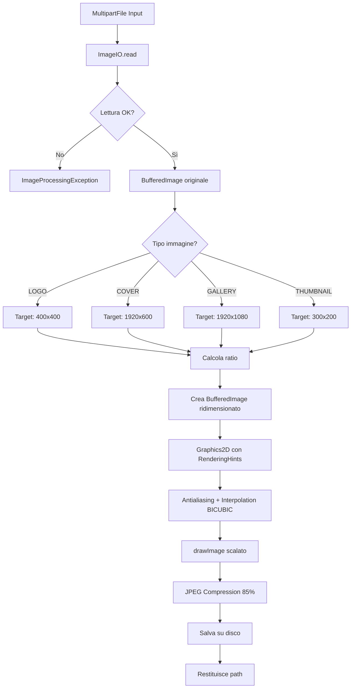
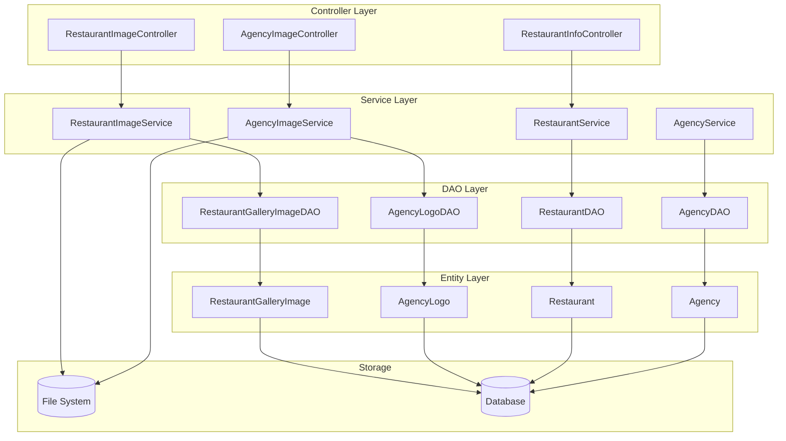

# Diagrammi di Flusso - Sistema Galleria Immagini

Questo documento contiene i diagrammi di flusso per le funzionalità di gestione immagini e descrizioni per Restaurant e Agency.

---

## 1. Upload Logo Ristorante

```mermaid
flowchart TD
    A[Client] -->|POST /api/v1/restaurant/{id}/images/logo| B[RestaurantImageController]
    B --> C{Validazione File}
    C -->|File vuoto| D[400 Bad Request]
    C -->|File valido| E[RestaurantImageService.uploadLogo]
    E --> F{Validazione Immagine}
    F -->|Non è immagine| G[InvalidImageException]
    F -->|Dimensione > 10MB| H[InvalidImageException]
    F -->|Valido| I[Ridimensiona a 400x400]
    I --> J[Comprimi JPEG 85%]
    J --> K[Salva su disco]
    K --> L{Logo esistente?}
    L -->|Sì| M[Elimina vecchio logo]
    L -->|No| N[Continua]
    M --> N
    N --> O[Salva metadata in DB]
    O --> P[RestaurantGalleryImageDAO.save]
    P --> Q[Restituisce ImageUploadResponse]
    Q --> R[200 OK con URL]
    
    G --> S[400 Bad Request]
    H --> S
```

---

## 2. Upload Cover Ristorante

```mermaid
flowchart TD
    A[Client] -->|POST /api/v1/restaurant/{id}/images/cover| B[RestaurantImageController]
    B --> C{Validazione File}
    C -->|File vuoto| D[400 Bad Request]
    C -->|File valido| E[RestaurantImageService.uploadCover]
    E --> F{Validazione Immagine}
    F -->|Non è immagine| G[InvalidImageException]
    F -->|Dimensione > 10MB| H[InvalidImageException]
    F -->|Valido| I[Ridimensiona a 1920x600]
    I --> J[Comprimi JPEG 85%]
    J --> K[Salva su disco]
    K --> L{Cover esistente?}
    L -->|Sì| M[Elimina vecchia cover]
    L -->|No| N[Continua]
    M --> N
    N --> O[Salva metadata in DB]
    O --> P[200 OK con URL]
    
    G --> Q[400 Bad Request]
    H --> Q
```

---

## 3. Upload Immagine Galleria Ristorante

```mermaid
flowchart TD
    A[Client] -->|POST /api/v1/restaurant/{id}/images/gallery| B[RestaurantImageController]
    B --> C{Validazione File}
    C -->|File vuoto| D[400 Bad Request]
    C -->|File valido| E[RestaurantImageService.uploadGalleryImage]
    E --> F{Validazione Immagine}
    F -->|Non valido| G[400 Bad Request]
    F -->|Valido| H[Ridimensiona a 1920x1080]
    H --> I[Crea Thumbnail 300x200]
    I --> J[Comprimi JPEG 85%]
    J --> K[Salva immagine principale]
    K --> L[Salva thumbnail]
    L --> M[Calcola displayOrder]
    M --> N[Salva metadata in DB]
    N --> O[200 OK con URL e thumbnailUrl]
```

---

## 4. Eliminazione Immagine Galleria

```mermaid
flowchart TD
    A[Client] -->|DELETE /api/v1/restaurant/{id}/images/{imageId}| B[RestaurantImageController]
    B --> C[RestaurantImageService.deleteImage]
    C --> D{Immagine esiste?}
    D -->|No| E[404 Not Found]
    D -->|Sì| F{Appartiene al ristorante?}
    F -->|No| G[403 Forbidden]
    F -->|Sì| H[Elimina file da disco]
    H --> I{Ha thumbnail?}
    I -->|Sì| J[Elimina thumbnail]
    I -->|No| K[Continua]
    J --> K
    K --> L[Elimina record DB]
    L --> M[204 No Content]
```

---

## 5. Upload Logo Agenzia

```mermaid
flowchart TD
    A[Client] -->|POST /api/v1/agency/{id}/logo| B[AgencyImageController]
    B --> C{Validazione File}
    C -->|File vuoto| D[400 Bad Request]
    C -->|File valido| E[AgencyImageService.uploadLogo]
    E --> F{Validazione Immagine}
    F -->|Non è immagine| G[InvalidImageException]
    F -->|Dimensione > 10MB| H[InvalidImageException]
    F -->|Valido| I[Ridimensiona a 400x400]
    I --> J[Comprimi JPEG 85%]
    J --> K[Salva su disco ./uploads/agencies/{id}/]
    K --> L{Logo esistente?}
    L -->|Sì| M[Elimina vecchio logo]
    L -->|No| N[Continua]
    M --> N
    N --> O[Salva metadata in DB AgencyLogo]
    O --> P[AgencyLogoDAO.save]
    P --> Q[Restituisce AgencyLogoUploadResponse]
    Q --> R[200 OK con URL]
    
    G --> S[400 Bad Request]
    H --> S
```

---

## 6. Gestione Descrizione Ristorante

```mermaid
flowchart TD
    subgraph "Aggiornamento Descrizione"
        A1[Client] -->|PUT /api/v1/restaurant/{id}/description| B1[RestaurantInfoController]
        B1 --> C1{Body presente?}
        C1 -->|No| D1[400 Bad Request]
        C1 -->|Sì| E1[RestaurantService.updateDescription]
        E1 --> F1{Ristorante esiste?}
        F1 -->|No| G1[IllegalArgumentException]
        F1 -->|Sì| H1[Aggiorna campo description]
        H1 --> I1[RestaurantDAO.save]
        I1 --> J1[200 OK]
        G1 --> K1[404 Not Found]
    end
    
    subgraph "Lettura Descrizione"
        A2[Client] -->|GET /api/v1/restaurant/{id}/description| B2[RestaurantInfoController]
        B2 --> C2[RestaurantService.getDescription]
        C2 --> D2{Ristorante esiste?}
        D2 -->|No| E2[404 Not Found]
        D2 -->|Sì| F2[Leggi campo description]
        F2 --> G2[200 OK con descrizione]
    end
```

---

## 7. Gestione Descrizione Agenzia

```mermaid
flowchart TD
    subgraph "Aggiornamento Descrizione"
        A1[Client] -->|PUT /api/v1/agency/{id}/description| B1[AgencyImageController]
        B1 --> C1{Body presente?}
        C1 -->|No| D1[400 Bad Request]
        C1 -->|Sì| E1[AgencyService.updateDescription]
        E1 --> F1{Agenzia esiste?}
        F1 -->|No| G1[IllegalArgumentException]
        F1 -->|Sì| H1[Aggiorna campo description]
        H1 --> I1[AgencyDAO.save]
        I1 --> J1[200 OK]
        G1 --> K1[404 Not Found]
    end
    
    subgraph "Lettura Descrizione"
        A2[Client] -->|GET /api/v1/agency/{id}/description| B2[AgencyImageController]
        B2 --> C2[AgencyService.getDescription]
        C2 --> D2{Agenzia esiste?}
        D2 -->|No| E2[404 Not Found]
        D2 -->|Sì| F2[Leggi campo description]
        F2 --> G2[200 OK con descrizione]
    end
```

---

## 8. Flusso Completo di Ridimensionamento Immagine



---

## 9. Architettura del Sistema Immagini



---

## 10. Riordinamento Immagini Galleria

```mermaid
flowchart TD
    A[Client] -->|PUT /api/v1/restaurant/{id}/images/reorder| B[RestaurantImageController]
    B --> C[Riceve List di imageId]
    C --> D[RestaurantImageService.reorderImages]
    D --> E{Tutti gli ID appartengono al ristorante?}
    E -->|No| F[400 Bad Request]
    E -->|Sì| G[Loop su ogni imageId]
    G --> H[i = 0]
    H --> I[image.setDisplayOrder i]
    I --> J[imageDAO.save image]
    J --> K{Altri ID?}
    K -->|Sì| L[i++]
    L --> I
    K -->|No| M[200 OK]
```

---

## 11. Impostazione Immagine Featured

```mermaid
flowchart TD
    A[Client] -->|PUT /api/v1/restaurant/{id}/images/{imageId}/featured| B[RestaurantImageController]
    B --> C[RestaurantImageService.setFeatured]
    C --> D{Immagine esiste?}
    D -->|No| E[404 Not Found]
    D -->|Sì| F{Appartiene al ristorante?}
    F -->|No| G[403 Forbidden]
    F -->|Sì| H[Rimuovi featured da altre immagini]
    H --> I[SELECT * WHERE restaurantId AND isFeatured = true]
    I --> J[Loop: setIsFeatured false]
    J --> K[Imposta nuova immagine come featured]
    K --> L[selectedImage.setIsFeatured true]
    L --> M[imageDAO.save]
    M --> N[200 OK]
```

---

## Riepilogo Endpoint

### Restaurant Images

| Metodo | Endpoint | Descrizione |
|--------|----------|-------------|
| POST | `/api/v1/restaurant/{id}/images/logo` | Upload logo 400x400 |
| POST | `/api/v1/restaurant/{id}/images/cover` | Upload cover 1920x600 |
| POST | `/api/v1/restaurant/{id}/images/gallery` | Upload immagine galleria 1920x1080 |
| GET | `/api/v1/restaurant/{id}/images` | Lista tutte le immagini |
| GET | `/api/v1/restaurant/{id}/images/logo` | Ottieni logo |
| GET | `/api/v1/restaurant/{id}/images/cover` | Ottieni cover |
| GET | `/api/v1/restaurant/{id}/images/gallery` | Lista immagini galleria |
| GET | `/api/v1/restaurant/{id}/images/featured` | Ottieni immagine featured |
| GET | `/api/v1/restaurant/{id}/images/{imageId}` | Ottieni singola immagine |
| DELETE | `/api/v1/restaurant/{id}/images/{imageId}` | Elimina immagine |
| PUT | `/api/v1/restaurant/{id}/images/reorder` | Riordina immagini |
| PUT | `/api/v1/restaurant/{id}/images/{imageId}/featured` | Imposta come featured |

### Restaurant Description

| Metodo | Endpoint | Descrizione |
|--------|----------|-------------|
| PUT | `/api/v1/restaurant/{id}/description` | Aggiorna descrizione |
| GET | `/api/v1/restaurant/{id}/description` | Ottieni descrizione |

### Agency Logo & Description

| Metodo | Endpoint | Descrizione |
|--------|----------|-------------|
| POST | `/api/v1/agency/{id}/logo` | Upload logo 400x400 |
| GET | `/api/v1/agency/{id}/logo` | Ottieni logo |
| DELETE | `/api/v1/agency/{id}/logo` | Elimina logo |
| PUT | `/api/v1/agency/{id}/description` | Aggiorna descrizione |
| GET | `/api/v1/agency/{id}/description` | Ottieni descrizione |

---

## Configurazione

Le proprietà configurabili in `application.properties`:

```properties
# Image upload configuration
image.upload.path=./uploads
image.upload.max-size=10485760
image.upload.allowed-types=image/jpeg,image/png,image/gif,image/webp
image.compression.quality=0.85
```

---

## Note Tecniche

1. **Ridimensionamento**: Utilizzo di `Graphics2D` con `RenderingHints.VALUE_INTERPOLATION_BICUBIC` per alta qualità
2. **Compressione**: JPEG con qualità 85% per bilanciare qualità/dimensione
3. **Storage**: File system locale con struttura `./uploads/{entity}/{id}/`
4. **Naming**: UUID + timestamp per evitare conflitti
5. **Cleanup**: Eliminazione automatica file precedenti per logo/cover
