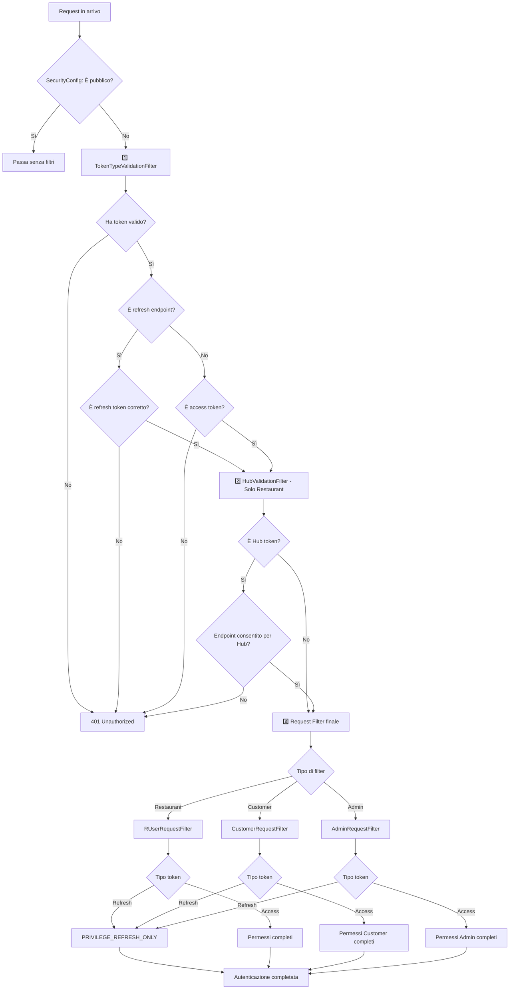

# 🔐 JWT Security Architecture - Documentazione Completa

## 📋 Panoramica

Abbiamo implementato un'architettura di sicurezza a 3 livelli per gestire correttamente i token JWT:

1. **TokenTypeValidationFilter** - Validazione del tipo di token (Access vs Refresh)
2. **HubValidationFilter** - Restrizioni per i token Hub
3. **RUserRequestFilter** - Autenticazione finale dell'utente

---

## 🎯 Endpoint di Refresh Configurati

Gli endpoint di refresh che richiedono **refresh token** sono:

- `/customer/auth/refresh` - Customer refresh token
- `/admin/auth/refresh` - Admin refresh token  
- `/restaurant/user/auth/refresh` - Restaurant user refresh token
- `/restaurant/user/auth/refresh/hub` - Restaurant Hub refresh token

Tutti gli altri endpoint protetti richiedono **access token**.

---

## 🔧 Architettura dei Filtri

### 1️⃣ TokenTypeValidationFilter
**Posizione**: `com.application.common.security.TokenTypeValidationFilter`

**Responsabilità**:
- ✅ Verifica che ci sia un token per endpoint protetti
- ✅ Endpoint di refresh devono usare refresh token
- ✅ Altri endpoint devono usare access token

**Logica**:
```java
if (isRefreshEndpoint(path)) {
    // Solo refresh token accettati
    if (!jwtUtil.isRefreshToken(token) && !jwtUtil.isHubRefreshToken(token)) {
        return UNAUTHORIZED;
    }
} else {
    // Solo access token accettati
    if (!jwtUtil.isAccessToken(token) && !jwtUtil.isHubToken(token)) {
        return UNAUTHORIZED;
    }
}
```

### 2️⃣ HubValidationFilter  
**Posizione**: `com.application.restaurant.HubValidationFilter`

**Responsabilità**:
- ✅ Restringe i token Hub a specifici endpoint
- ✅ Blocca token Hub su endpoint non autorizzati

**Endpoint consentiti per Hub token**:
- `/restaurant/user/auth/refresh/hub`
- `/restaurant/user/auth/refresh`  
- `/restaurant/order/**`
- `/restaurant/notification/**`
- `/restaurant/reservation/**`

### 3️⃣ RUserRequestFilter
**Posizione**: `com.application.restaurant.RUserRequestFilter`

**Responsabilità**:
- ✅ Autenticazione finale per Restaurant users
- ✅ Caricamento contesto utente
- ✅ Gestione SecurityContext
- ✅ **Permessi distinti per tipo token**:
  - **Hub Refresh Token** → `PRIVILEGE_REFRESH_ONLY`
  - **Hub Access Token** → `PRIVILEGE_HUB`, `PRIVILEGE_CHANGE_PASSWORD`
  - **Normal Refresh Token** → Permessi completi (per compatibilità)
  - **Normal Access Token** → Permessi completi

### 4️⃣ CustomerRequestFilter  
**Posizione**: `com.application.customer.CustomerRequestFilter`

**Responsabilità**:
- ✅ Autenticazione finale per Customer users
- ✅ **Permessi distinti per tipo token**:
  - **Refresh Token** → `PRIVILEGE_REFRESH_ONLY`
  - **Access Token** → Permessi completi originali

### 5️⃣ AdminRequestFilter
**Posizione**: `com.application.admin.AdminRequestFilter`

**Responsabilità**:
- ✅ Autenticazione finale per Admin users  
- ✅ **Permessi distinti per tipo token**:
  - **Refresh Token** → `PRIVILEGE_REFRESH_ONLY`
  - **Access Token** → Permessi completi originali

---

## 🧪 Test di Validazione

**File**: `AuthenticationEndpointValidationTest.java`

Questo test verifica automaticamente che:
- ✅ Tutti gli endpoint di refresh nei controller esistano nel filtro
- ✅ Non ci siano endpoint non gestiti nel filtro
- ❌ **Il test fallirà** se modifichi endpoint senza aggiornare il filtro

**Messaggio di errore quando fallisce**:
```
❌ ENDPOINT MANCANTE: '/nuovo/endpoint/refresh' è definito nel TokenTypeValidationFilter.isRefreshEndpoint() 
ma non esiste nei controller!
🔧 AZIONE RICHIESTA: Aggiorna TokenTypeValidationFilter.isRefreshEndpoint() 
```

---

## 🔄 SecurityConfig Sincronizzazione

I filtri sono configurati nel `SecurityConfig.java`:

```java
// 1️⃣ TokenTypeValidationFilter (primo)
.addFilterBefore(tokenTypeValidationFilter, UsernamePasswordAuthenticationFilter.class)

// 2️⃣ HubValidationFilter (secondo) 
.addFilterBefore(hubValidationFilter, RUserRequestFilter.class)

// 3️⃣ RUserRequestFilter (terzo)
.addFilterBefore(rUserRequestFilter, UsernamePasswordAuthenticationFilter.class)
```

**⚠️ IMPORTANTE**: 
- Gli endpoint pubblici sono esclusi a livello di SecurityConfig
- I filtri non devono più controllare endpoint pubblici
- L'ordine dei filtri è critico!

---

## 🛡️ Flusso di Validazione



---

## 🚀 Come Aggiungere Nuovi Endpoint

### 1. Aggiungi endpoint di refresh
```java
// Nel controller
@PostMapping("/nuovo/refresh")
public ResponseEntity<AuthResponseDTO> nuovoRefresh() { ... }

// Nel TokenTypeValidationFilter.isRefreshEndpoint()
return path.equals("/customer/auth/refresh") || 
       path.equals("/admin/auth/refresh") ||
       path.equals("/restaurant/user/auth/refresh") ||
       path.equals("/restaurant/user/auth/refresh/hub") ||
       path.equals("/nuovo/auth/refresh");  // ← AGGIUNGI QUI
```

### 2. Aggiungi endpoint consentito per Hub
```java
// Nel HubValidationFilter.isHubAllowedEndpoint()
return path.startsWith("/restaurant/order/") ||
       path.startsWith("/restaurant/notification/") ||
       path.startsWith("/restaurant/reservation/") ||
       path.equals("/restaurant/user/auth/refresh/hub") ||
       path.equals("/restaurant/user/auth/refresh") ||
       path.startsWith("/nuovo/hub/endpoint/");  // ← AGGIUNGI QUI
```

### 3. Esegui il test per verificare
```bash
mvn test -Dtest=AuthenticationEndpointValidationTest
```

---

## ✅ **IMPLEMENTAZIONE FINALE COMPLETATA!** 

### 🎯 **Obiettivo Raggiunto**
- ✅ **JWT Token Validation**: Distingue correttamente Access vs Refresh vs Hub tokens
- ✅ **Endpoint Security**: Ogni endpoint accetta solo il tipo di token appropriato  
- ✅ **Authority-Based Protection**: Endpoint di refresh protetti con `@PreAuthorize("hasAuthority('PRIVILEGE_REFRESH_ONLY')")`
- ✅ **Token Generation**: Refresh token generati con `PRIVILEGE_REFRESH_ONLY` authority

### 🔧 **Token Generation nel JwtUtil**
```java
// Refresh token normali
generateRefreshToken() → authorities: ["PRIVILEGE_REFRESH_ONLY"]

// Hub refresh token  
generateHubRefreshToken() → authorities: ["PRIVILEGE_REFRESH_ONLY"]

// Access token normali
generateToken() → authorities: [tutti i permessi originali]

// Hub access token
generateHubToken() → authorities: ["PRIVILEGE_HUB", "PRIVILEGE_CHANGE_PASSWORD"]
```

### 🛡️ **Filter Chain Completa**
1. **TokenTypeValidationFilter** → Valida tipo token corretto per endpoint
2. **HubValidationFilter** → Restringe Hub token a endpoint specifici  
3. **Request Filters** → Autenticazione con authorities corrette:
   - **RUserRequestFilter**: Logica Hub distingue Refresh vs Access
   - **CustomerRequestFilter**: Usa authorities dal token
   - **AdminRequestFilter**: Usa authorities dal token

### 🔐 **Endpoint Protection**
Tutti gli endpoint di refresh ora protetti con:
```java
@PreAuthorize("hasAuthority('PRIVILEGE_REFRESH_ONLY')")
```

**Endpoint protetti:**
- `/customer/auth/refresh`
- `/admin/auth/refresh` 
- `/restaurant/user/auth/refresh`
- `/restaurant/user/auth/refresh/hub`

---

## 🎉 Risultato Finale

**✅ OBIETTIVO RAGGIUNTO**: Sistema JWT completamente sicuro e coerente!

**✅ SICUREZZA MASSIMA**: 
- Refresh token limitati solo agli endpoint di refresh con `PRIVILEGE_REFRESH_ONLY`
- Hub token limitati a specifici endpoint e operazioni
- Access token con permessi completi per operazioni normali

**✅ ARCHITETTURA PULITA**:
- Filter chain ben definita e documentata  
- Authorities gestite direttamente nei token JWT
- Test automatici prevengono modifiche accidentali
- Separazione delle responsabilità tra filtri

**🚀 PRONTO PER PRODUZIONE!** L'architettura JWT è ora robusta, sicura e maintainabile.
